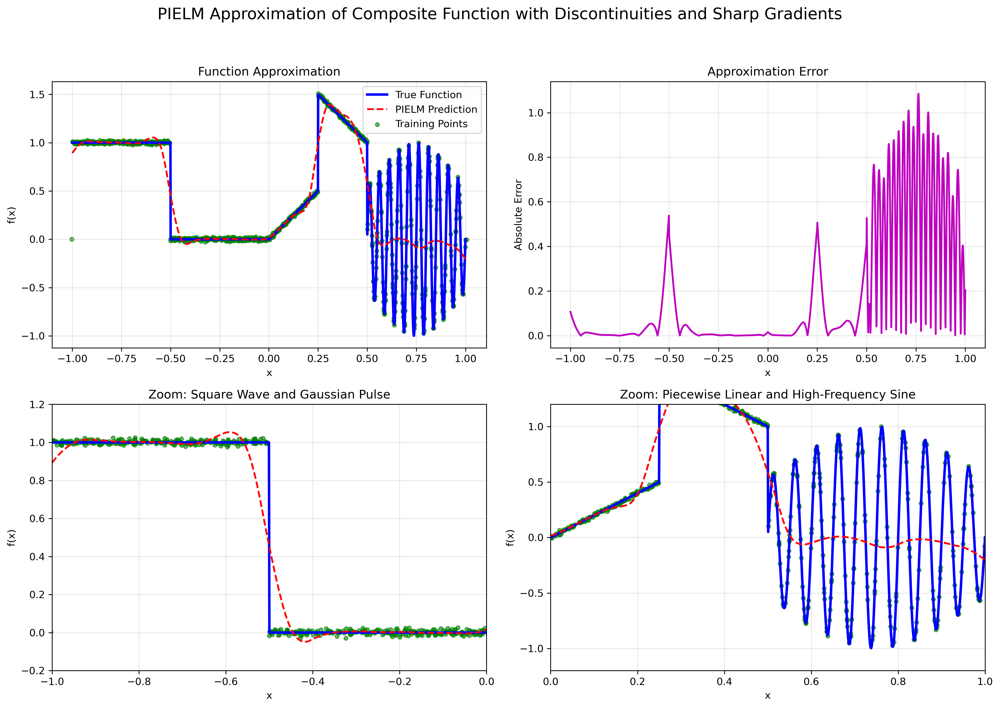

# Physics-Informed Neural Networks (PINNs) and Extensions

This repository contains comprehensive implementations of Physics-Informed Neural Networks (PINNs) and their extensions, including Physics-Informed Extreme Learning Machines (PIELM), and Fuzzy Physics-Informed Neural Networks (FPINNs) and some experiments with our novel network architectures.

## 📋 Table of Contents

- [Implementations & Experiments](#implementations--experiments)
- [PDE Solutions & Visualizations](#pde-solutions--visualizations)
- [Related Work](#related-work)
- [Contributing](#contributing)
- [License](#license)


## 🧠 Implementations & Experiments

This repository implements several PINN variants and their extensions:

### PINN Implementations
- **Standard PINNs**: Deep neural networks with automatic differentiation
- **Physics-Informed Extreme Learning Machines (PIELM)**: Fast training with random weights and least squares solution
- **Fuzzy Physics-Informed Neural Networks (FPINNs)**: Integration of fuzzy logic for uncertainty handling

### Test Cases
| Test Case | PDE Type | Description |
|-----------|----------|-------------|
| **TC-01** | Advection | Steady-state advection equation |
| **TC-02** | Diffusion | Steady-state diffusion equation |
| **TC-03** | Advection-Diffusion | Combined transport phenomena |
| **TC-04** | 2D Advection | Two-dimensional advection |
| **TC-05** | 2D Diffusion | Two-dimensional diffusion |
| **TC-07** | Unsteady Advection | Time-dependent advection (constant velocity) |
| **TC-08** | Unsteady Advection | Time-dependent advection (variable velocity) |
| **TC-09** | Sharp Gradients | Composite function with discontinuities |

## 📊 PDE Experiments

This project demonstrates solving various partial differential equations using different PINN architectures. Below are key experimental results:

### TC-01: Steady-State Advection Equation
```
∂u/∂t + c ∂u/∂x = 0
```
**Description**: Wave propagation with constant velocity. Both our model and PIELM achieve excellent accuracy.

**PIELM Results (TC-01)**:


### TC-04: 2D Advection Equation
```
∂u/∂t + c·∇u = 0
```
**Description**: Two-dimensional wave propagation. Our model demonstrates robust performance in 2D domains.


### TC-08: Unsteady Advection (Variable Velocity)
```
∂u/∂t + c(x,t) ∂u/∂x = 0
```
**Description**: Time-dependent advection with variable velocity field. Shows excellent temporal evolution accuracy.


### TC-09: Sharp Gradient Handling
**Description**: Complex functions with discontinuities and high-frequency components. Demonstrates capability to handle challenging features.


```

**Note**: Solutions for nonlinear equations are currently under development and improvement.


## 📚 Related Work

### Key References

All referenced papers are available in the [`papers/`](papers/) folder for easy access.

#### Foundational Papers

1. **[Raissi, M., Perdikaris, P., & Karniadakis, G. E. (2019)](papers/nonlinear%20partial%20differential%20equations.M.Raissi.pdf)**  
   "Physics-informed neural networks: A deep learning framework for solving forward and inverse problems involving nonlinear partial differential equations"  
   *Journal of Computational Physics*, 378, 686-707.

2. **[Takagi, T., & Sugeno, M. (1985)](papers/Fuzzy_identification_of_systems_and_its_applications_to_modeling_and_control.pdf)**  
   "Fuzzy Identification of Systems and Its Applications to Modeling and Control"  
   *IEEE Transactions on Systems, Man, and Cybernetics*, SMC-15(1).

3. **[Physics-Informed Extreme Learning Machine](papers/Physics%20Informed%20Extreme%20Learning%20Machine%20(PIELM)–A%20rapid%20method.pdf)**  
   "Physics Informed Extreme Learning Machine (PIELM)–A rapid method for the solution of forward and inverse multiscale linear problems"

4. **[What are Extreme Learning Machines](papers/What%20are%20Extreme%20Learning%20Machines%20Filling%20the%20Gap%20Between.pdf)**  
   "What are Extreme Learning Machines? Filling the Gap Between Frank Rosenblatt's Dream and John von Neumann's Puzzle"

5. **[Universal Approximation Capability of BLS](papers/J%202019%20Universal_Approximation_Capability_of_Broad_Learning_System_and_Its_Structural_Variations.pdf)**  
   "Universal Approximation Capability of Broad Learning System and Its Structural Variations"

6. **[BLS Research Review](papers/J%202022%20Research_Review_for_Broad_Learning_System_Algorithms_Theory_and_Applications.pdf)**  
   "Research Review for Broad Learning System: Algorithms, Theory and Applications"

#### Extensions and Improvements

7. **[Wu, W., et al.](papers/Deep%20fuzzy%20physics-informed%20neural%20networks%20for%20forward%20and%20inverse%20PDE.pdf)**  
   "Deep fuzzy physics-informed neural networks for forward and inverse PDE problems"  
   *IEEE Transactions on Fuzzy Systems*, 32(10), 5951.

8. **[Deng, H. P., et al. (2024)](papers/Physics-Informed_Spatial_Fuzzy_System_and_Its_Applications_in_Modeling.pdf)**  
   "Physics-Informed Spatial Fuzzy System and Its Applications in Modeling"  
   *IEEE Transactions on Fuzzy Systems*, 32(10), 5951.

9. **[Fuhg, J. N., et al.](papers/Interval%20and%20fuzzy%20physics-informed%20neural%20networks%20for%20uncertain%20fields.pdf)**  
   "Interval and fuzzy physics-informed neural networks for uncertain fields"  
   *Probabilistic Engineering Mechanics*.

10. **[Chen, Y., & Koohy, S. (2024)](papers/GPT-PINN-Generative%20Pre-Trained%20Physics-Informed%20Neural.pdf)**  
    "GPT-PINN: Generative Pre-Trained Physics-Informed Neural Networks toward non-intrusive Meta-learning of parametric PDEs"  
    *IEEE Control Systems Letters*, 8, 1763.

11. **[Song, Y., et al.](papers/Loss-attentional%20physics-informed%20neural%20networks.pdf)**  
    "Loss-attentional physics-informed neural networks"  
    *Journal of Computational Physics*.

12. **[Wong, S. Y., et al. (2015)](papers/On_Equivalence_of_FIS_and_ELM_for_Interpretable_Rule-Based_Knowledge_Representation.pdf)**  
    "On Equivalence of FIS and ELM for Interpretable Rule-Based Knowledge Representation"  
    *IEEE Transactions on Neural Networks and Learning Systems*, 26(7), 1417.

13. **[Yin, F., et al.](papers/Pseudo%20inverse%20versus%20iterated%20projection-%20Novel%20learning.pdf)**  
    "Pseudo inverse versus iterated projection: Novel learning approach and its application on broad learning system"  
    *Neural Networks*.

14. **[Feng, S., & Chen, C. L. P. (2021)](papers/Performance%20analysis%20of%20fuzzy%20BLS%20using%20different.pdf)**  
    "Performance analysis of fuzzy BLS using different cluster methods for classification"  
    *Science China Information Sciences*, 64, 149205:1–149205:3.

15. **[Fuzzy Broad Learning System](papers/Fuzzy_Broad_Learning_System_A_Novel_Neuro-Fuzzy_Model_for_Regression_and_Classification.pdf)**  
    "Fuzzy Broad Learning System: A Novel Neuro-Fuzzy Model for Regression and Classification"

16. **[EFBLS](papers/EFBLS.pdf)**  
    "Extreme Fuzzy Broad Learning System"

17. **[Extreme Fuzzy BLS with Frequency Principle](papers/Extreme_Fuzzy_Broad_Learning_System__Algorithm__Frequency_Principle__and_Applications_in_Classification_and_Regression%20(1).pdf)**  
    "Extreme Fuzzy Broad Learning System: Algorithm, Frequency Principle, and Applications in Classification and Regression"

#### Advanced PINN Techniques

18. **[Adaptive Weighted Loss PINNs](papers/Physics-informed%20neural%20networks%20based%20on%20adaptive%20weighted%20loss.pdf)**  
    "Physics-informed neural networks based on adaptive weighted loss"

19. **[Residual-based Attention](papers/Residual-based%20attention%20and%20connection%20to%20information.pdf)**  
    "Residual-based attention and connection to information bottleneck theory in PINNs"

20. **[SoftAdapt Techniques](papers/SoftAdapt-Techniques%20for%20Adaptive%20Loss%20Weighting%20of%20Neural%20Networks%20with.pdf)**  
    "SoftAdapt: Techniques for Adaptive Loss Weighting of Neural Networks with Applications"

21. **[When and Why PINNs Fail](papers/When%20and%20why%20PINNs%20fail%20to%20train%20A%20neural%20tangent%20kernel.pdf)**  
    "When and why PINNs fail to train: A neural tangent kernel perspective"

22. **[Revisiting PINNs](papers/Revisiting%20PINNs-Generative%20Adversarial.pdf)**  
    "Revisiting PINNs: Generative Adversarial Physics-informed Neural Networks"


